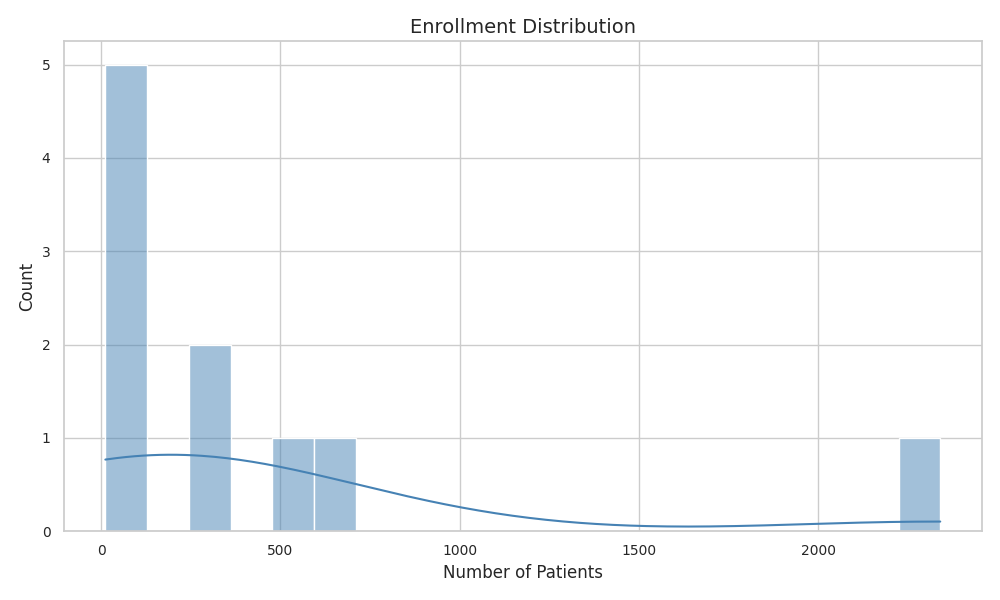
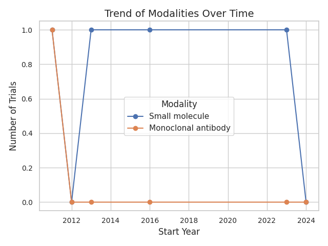
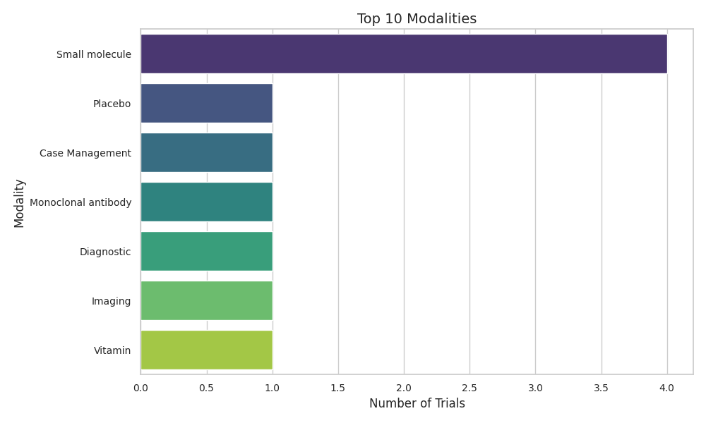
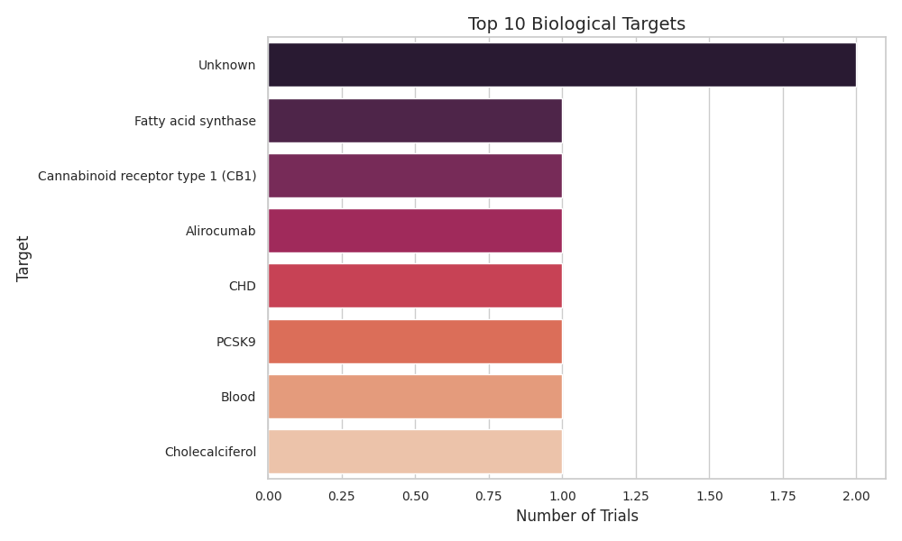
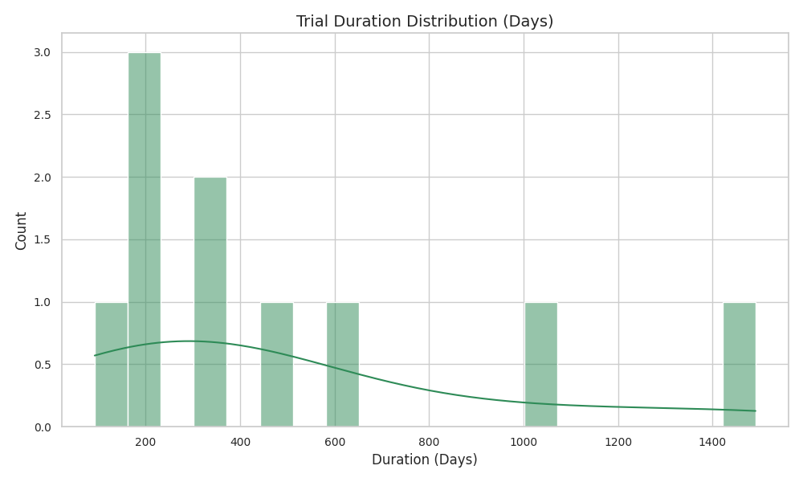

# Clinical Trials Processing & Modality/Target Analysis

## 📑 Project Overview
This project processes clinical trial data related to specific diseases (e.g., Familial Hypercholesterolemia), enriches it with modality and biological target information, and provides structured quantitative summaries, insightful qualitative trends, and visual analytics.

### 🔥 Deliverables:
- ✅ Functional Python notebook (`ClinicalTrials_With_OpenAI_Final.ipynb`)
- ✅ Final enriched dataset (`enriched_trials.csv`)
- ✅ Quantitative summary table (`quantitative_summary_table.csv`)
- ✅ Summary visualizations (embedded below and saved separately)
- ✅ Written qualitative insights

---

## 🔥 Key Features
- Fetches studies using **ClinicalTrials.gov API**.
- Filters to include only:
  - Interventional
  - Industry-sponsored
  - Human studies
  - Start dates within the last 15 years
- Extracts important attributes: Enrollment numbers, outcome measures, sponsor names, study dates, modality, and target.
- Enriches intervention names dynamically using **OpenAI GPT** to determine **Modality** and **Biological Target**.
- Generates both **quantitative** and **qualitative** summaries.

---

## 📊 Visualizations

### Enrollment Distribution
Shows how many patients were enrolled across trials.  

### Median Enrollment Over Time
Tracks how median patient enrollment evolved over the years.  

### Modality Trend Over Time
Tracks how the use of different therapeutic modalities has evolved.  

### Top 10 Modalities
Most frequently explored therapeutic modalities.  

### Top 10 Biological Targets
Most commonly targeted molecules or pathways.  

### Trial Duration Distribution
Distribution of trial lengths across studies.  

### Median Trial Duration Over Time
How the length of trials has changed across years.  

---

## ✍️ Qualitative Insights: Familial Hypercholesterolemia Clinical Trials

### 🔬 Trends in Modality and Mechanism of Action
- Small molecules and monoclonal antibodies dominate the therapeutic landscape.
- Behavioral therapies have been explored but remain less common.
- Recent years show rising interest in gene therapies and RNA-based therapeutics (e.g., siRNA).

### 🎯 Trends in Primary and Secondary Outcome Measures
- Early trials mainly evaluated LDL-C percentage reductions and basic lipid profile improvements.
- Later studies shifted towards hard cardiovascular outcomes (e.g., heart attack incidence, mortality rates) and quality-of-life metrics.
- Secondary outcomes evolved to include genetic screenings and long-term lipid regulation markers.

### 📈 Observations on Trial Design
- Enrollment sizes have shown a declining trend, reflecting increasing focus on targeted therapies with well-defined patient groups.
- Trial durations have also become shorter, possibly due to improved regulatory pathways and accelerated therapeutic developments.

---

---

## 📈 Technologies Used
- **Python** (Pandas, Matplotlib, Seaborn)
- **OpenAI GPT** (for modality and biological target enrichment)
- **ClinicalTrials.gov API v2**
- **Google Colab Environment**

---

# 🚀 How to Run
1. Clone the repo.
2. Open `ClinicalTrials_With_OpenAI_Final.ipynb` in Google Colab.
3. Install required libraries.
4. Execute the notebook sequentially.

---

# 📬 Contact
Feel free to reach out for questions or collaborations!  
🔗 [LinkedIn](https://www.linkedin.com/in/janhavipatil5/) | [GitHub](https://github.com/janhavi502)
